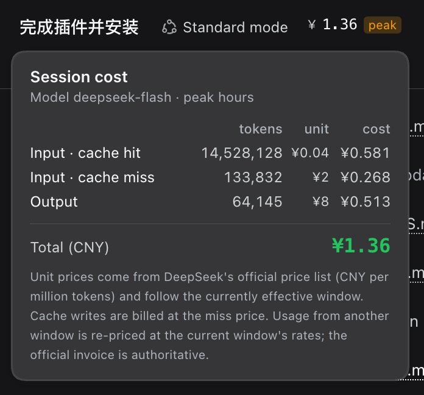

# dsh-session-cost

DeepSeek Harness（dsh）客户端插件：在 Web GUI 的会话头部实时显示**本次会话的人民币花费**，
点击即可展开按 token bucket 拆分的明细。价格直接取自 DeepSeek 官方价目表，**以人民币计价**，
不做任何汇率换算。



图中为高峰时段：会话头部右侧是默认收起的花费标记，点开后是按 token bucket 拆分的明细。

文字示意（这组金额同样被 smoke test 固定住）：

```
会话头部右侧 →  ¥3.04  [闲]      ← 点击展开
                ┌──────────────────────────────────┐
                │ 本会话花费                        │
                │ 模型 deepseek-flash · 空闲时段     │
                │ ──────────────────────────────── │
                │ 输入 · 缓存命中   2,000,000  ¥0.02  ¥0.04
                │ 输入 · 缓存未命中 1,000,000  ¥1     ¥1.00
                │ 输出               500,000   ¥4     ¥2.00
                │ ──────────────────────────────── │
                │ 合计（人民币）              ¥3.04  │
                └──────────────────────────────────┘
```

## 安装

```sh
# 1) 装进目标 profile
#    从 GitHub 装（版本锁定在具体 commit，适合日常使用）
dsh plugin --profile web add github:madeye/dsh-session-cost

#    或从本地目录装成 link:（改完代码刷新即生效，适合开发）
dsh plugin --profile web add /Volumes/DATA/workspace/dsh-session-cost

# 2) 在 profile 的 patch 层里注册宿主行
#    ~/.dsh/profiles/web/cordis.patch.yml
```

```yaml
- insert:
    - id: session-cost
      name: dsh-session-cost
```

```sh
# 3) 确认 patch 已合成进配置树
dsh --profile web --dump-config | grep -A2 session-cost
```

**然后刷新浏览器页面。** 客户端插件的清单只在页面加载时随 `window.__DSH_BOOT__` 注入，
所以新装的插件必须刷新一次才会出现。

两种安装方式的差别：

| 安装方式 | profile 里的 spec | 改动 `lib/client.js` 之后 |
|---|---|---|
| GitHub | `github:madeye/dsh-session-cost`（锁定 commit） | 先 push，再重跑 `dsh plugin ... add`，然后刷新页面 |
| 本地目录 | `link:/path/to/dsh-session-cost` | 直接刷新页面即可 |

无论哪种安装方式，只要 `package.json` 有变更（例如 `dsh.client`），都要重跑 `dsh plugin ... add`。

### 卸载

```sh
dsh plugin --profile web remove dsh-session-cost
# 再把 cordis.patch.yml 里那段 insert 删掉
```

## 计费口径

价格来自 <https://api-docs.deepseek.com/zh-cn/quick_start/pricing>，**单位：人民币元 / 百万 tokens**。

| 项目 | deepseek-flash（V4.1-Flash） | deepseek-v4-pro |
|---|---|---|
| 输入 · 缓存命中 | 空闲 0.02 / 高峰 0.04 | 空闲 0.15 / 高峰 0.30 |
| 输入 · 缓存未命中 | 空闲 1 / 高峰 2 | 空闲 4.5 / 高峰 9.0 |
| 输出 | 空闲 4 / 高峰 8 | 空闲 13.5 / 高峰 27.0 |

**高峰时段** = 北京时间周一至周五 09:00–12:00 与 14:00–18:00，其余均为空闲时段；
空闲价恰好是高峰价的一半。时段判定把时间戳平移 8 小时后读取 **UTC** 字段，得到北京墙上时钟，
不依赖运行环境时区（smoke test 与 `Intl` / `Asia-Shanghai` 逐小时比对了一周 × 24 小时）。

### token bucket 与「缓存写入」

用量来自 `dsh-token-meter` 的 `tokenUsage` projection。四个 bucket
**分别计量、互不重复**（disjoint）：

| projection 字段 | 计费 tier |
|---|---|
| `cacheReadTokens` | cache hit 价 |
| `uncachedInputTokens` | cache miss 价 |
| `cacheWriteTokens` | **cache miss 价** |
| `outputTokens` | output 价 |

官方价目表只区分 cache hit / cache miss 两类，而首次把前缀写入缓存的那次请求本身就是
cache miss，所以 `cacheWriteTokens` 按 cache miss 价计费；它与 `uncachedInputTokens`
是两个独立的 bucket，不会重复计费。

### 已知口径限制

- **跨时段的历史会按当前时段重算。** projection 只给出累计 token 数，不记录「每个 token 产生于什么
  时刻」。因此明细里的金额，是把全部累计用量按此刻生效的单价折算出来的；一旦跨过高峰/空闲
  边界，整笔金额会跳变一次。真实账单以官方为准——面板底部也写明了这一点。
- **切换模型后会按新模型单价重算全部历史。** `tokenUsage` 没有按模型拆分的字段。
- 这是**成本展示**而非账单：不计赠送余额、折扣、并发计费等。

## 实现

浏览器半侧是单文件，无构建步骤：

| 文件 | 作用 |
|---|---|
| `lib/index.js` | 宿主半侧：空 `apply()`，只为让插件出现在 Loader 里 |
| `lib/client.js` | 浏览器半侧：用 `window.__ModuleLoader__.load(...)` 包装的 React 组件 |
| `scripts/smoke.mjs` | smoke test：加载 bundle、跑 `apply`、渲染、校验计费算术 |

挂载点是 `conversation.session.header.actions` slot（`order: 15`），属于会话作用域。

数据来源不依赖该 slot 恰好提供哪些标准 props：插件通过**slot 自己的 `inject`**，从
`ctx.sessions.binding(sessionId).session.projections.faceOf(...)` 取到 `tokenUsage` 与
`modelSelection` 两个 observable，`useProjection` 仅作兜底。两条路径都取不到用量时，
组件返回 `null`，既不占位也不报错。

## 开发

```sh
cd /Volumes/DATA/workspace/dsh-session-cost
node scripts/smoke.mjs      # 48 项断言
```

smoke test 覆盖：bundle 注册 id、`apply`/`inject` 契约、slot 注册描述符、observable 注入、
会话绑定缺失时的降级、四个 bucket 的计费与缓存写入口径、金额格式化、高峰判定的时区比对、
flash 空闲 / flash 高峰 / pro 空闲三个 tier 的端到端渲染金额，以及点击展开明细面板。此外还钉住两处
容易静默失效的地方：

- **注入命名契约**：按运行时的同一条规则（`hooks.<key>` → prop `use<Key>`）从 `inject` 的
  真实输出构造 props 再渲染。任何一侧改名都会直接渲染不出金额，而不是静默退化成
  `useProjection` 兜底。
- **挂钟心跳**：面板收起时也照样注册 30 秒定时器。测试只推进时间、不改 props，单价与
  「峰 / 闲」标记必须自行翻过边界。

改完 `lib/client.js` 能否只靠刷新浏览器生效，取决于 profile 的安装方式（见「安装」一节的对照
表）：`link:` 直接刷新即可，GitHub 安装要先 push 再重跑 `dsh plugin ... add`。
